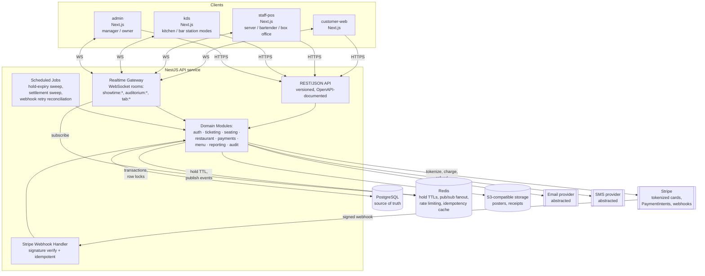

# Architecture

Status: Draft v1
Related: PRODUCT_SPEC.md, DATA_MODEL.md, SEAT_RESERVATION_DESIGN.md, PAYMENT_FLOW.md, SECURITY.md

## 1. Style: modular monolith, not microservices

One deployable API service (NestJS) with hard internal module boundaries, backed by one PostgreSQL database, one Redis instance, and several thin frontend apps. Microservices are explicitly rejected for MVP: this team is small, the domain is one connected business process (seat → tab → payment), and cross-service transactions would make the seat/payment correctness guarantees this system depends on much harder to build correctly. Modules are structured so specific ones (payments, restaurant, ticketing) could be extracted into services later if load requires it, without a data-model rewrite.

## 2. Why NestJS for the API, not a Next.js backend

The spec allows either. NestJS is chosen because:

- The domain has many long-lived server-side concerns that don't map well to Next.js route handlers: a real-time gateway (WebSocket rooms per showtime/auditorium/tab), scheduled jobs (settlement sweep, hold expiry reconciliation), a payment webhook processor with strict ordering/idempotency needs, and fine-grained RBAC guards applied uniformly across ~40+ endpoints.
- Four distinct frontends (customer-web, staff-pos, kds, admin) consume the same API. A dedicated API with generated OpenAPI types keeps them in sync without coupling any one frontend's build to the backend.
- NestJS's module system directly mirrors the domain boundaries called for in the spec (ticketing, restaurant, payments, auth, reporting), which keeps "modular monolith" honest instead of aspirational.

Trade-off accepted: one more deployable, one more local dev process. Mitigated with Docker Compose for local dev (single `docker compose up`).

## 3. Why Prisma over Drizzle

Both are reasonable. Prisma is chosen for MVP because migration tooling, schema readability, and Prisma Studio matter more than query-builder performance at this stage, and the team (including future contributors) benefits from Prisma's stronger conventions and documentation. The one place Prisma's abstraction is insufficient — seat-hold/purchase concurrency control — is handled with raw SQL (`$transaction` + `SELECT ... FOR UPDATE` / a unique constraint race) documented in SEAT_RESERVATION_DESIGN.md, so we are not blocked by the ORM where correctness is critical. This is a revisitable decision; it is not a one-way door since the domain layer is written against a repository interface, not directly against Prisma calls, in the hot paths.

## 4. Repository structure

Monorepo, managed with pnpm workspaces + Turborepo (build caching/task orchestration across apps/packages).

```
/apps
  /customer-web      # Next.js — public site, seat map, checkout, live tab, account
  /staff-pos         # Next.js — server/bartender ordering UI + box office UI (role-gated views in one app)
  /kds               # Next.js — kitchen display + bar display (station-filtered mode of the same app)
  /admin             # Next.js — manager/owner dashboard, config, reporting, audit log
  /api                # NestJS — the single backend service

/packages
  /database           # Prisma schema, migrations, seed scripts, generated client re-export
  /shared              # cross-cutting TS types, zod schemas, enums (seat states, order states, etc.), event contracts
  /ui                  # shared design-system components (customer-facing "cinematic" theme + POS "high-contrast" theme)
  /auth                # session/JWT helpers, RBAC permission definitions, guards usable by NestJS and by frontends for UI hints
  /payments            # PaymentProvider interface + StripeProvider implementation, no processor-specific code outside this package
  /ticketing           # domain logic: seat holds, ticket orders, QR generation/verification (used by /api, tested independently)
  /restaurant          # domain logic: tabs, orders, routing, settlement calculations (used by /api, tested independently)
  /notifications       # EmailProvider / SmsProvider interfaces + concrete adapters
  /config              # eslint/tsconfig/prettier shared config

/docs                  # this documentation set
/infra                  # Dockerfiles, docker-compose, IaC (deferred detail until Milestone 11)
```

Box office is a role/view inside `staff-pos`, not a separate app: it is the same "select showtime → see auditorium graphically → act on a seat" interaction as the server view, with a different permission set and action menu. Bar display is a station filter inside `kds`, not a separate app, per the spec's KDS/BDS similarity.

## 5. High-level architecture diagram



## 6. Real-time design

Single WebSocket gateway, Redis-backed adapter so it scales across multiple API instances (Redis pub/sub fans events out to all instances, each instance pushes to its own connected sockets). Clients subscribe to rooms scoped to what they're looking at:

- `showtime:{id}` — seat map viewers (customer seat selection page, box office) receive `SEAT_HELD`, `SEAT_RELEASED`, `SEAT_SOLD`.
- `auditorium:{id}:{showtimeId}` — server POS auditorium view receives seat/tab status changes for that screening.
- `tab:{id}` — customer live-tab page and the server's ticket detail view receive `ORDER_CREATED`, `ORDER_UPDATED`, `ITEM_READY`, `TAB_UPDATED`, `TAB_CLOSED`.
- `station:{kitchen|bar|concessions}:{locationId}` — KDS/BDS receive new/updated fulfillment tickets for their station only.
- `menu:{locationId}` — all POS surfaces receive `MENU_ITEM_86D` / restored.

Every event carries the authoritative post-change state (not just a delta) so a client that missed events (reconnect after a dropped tablet connection) can resync by re-fetching the relevant resource and trusting the next event. WebSocket delivery is treated as an optimization, never as the system of record — every event is only ever a notification to re-sync or reflects a state Postgres already committed. Clients also poll/refetch on reconnect as a fallback, since the spec requires the system to survive a server tablet losing connection.

## 7. Deployment shape

Docker-compatible from day one. Local dev: `docker-compose.yml` running Postgres, Redis, and the API; frontends run via `pnpm dev` per app or containerized. Production target (detailed in Milestone 11): containerized API behind a load balancer, managed Postgres, managed Redis, frontends deployed as their own services (e.g., Vercel or containers behind the same LB) — exact hosting choice deferred, see OPEN_QUESTIONS.md. No production secrets in source control; environment variables validated at boot (fail fast if a required secret is missing) using a schema in `/packages/config`.

## 8. Observability (introduced incrementally, hardened in Milestone 11)

Structured JSON logging from Milestone 0 (every log line includes request id, actor id/role, location id where applicable). Financial and seat-state-changing operations log before/after state. Error tracking (e.g., Sentry-class tool) and basic metrics/health checks added by Milestone 0 as a thin layer; full dashboards/alerting/load testing deferred to Milestone 11 per the spec's prioritization.
