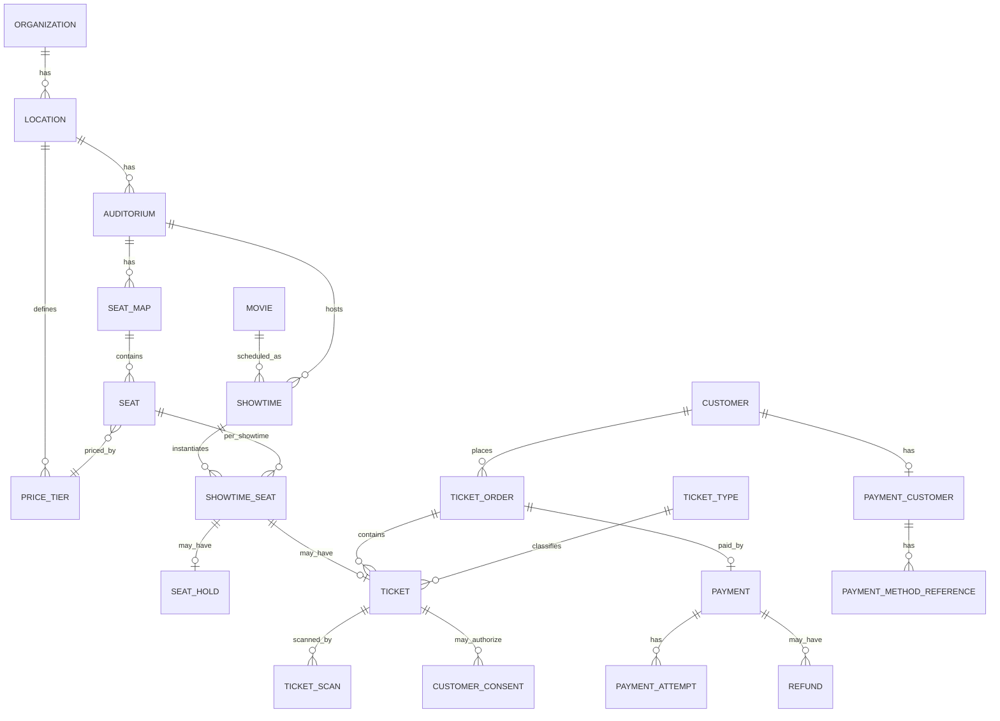
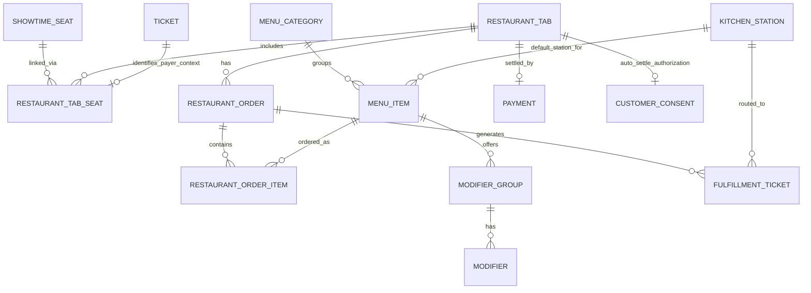

# Data Model

Status: Draft v1 — PostgreSQL, Prisma-managed migrations.
Related: STATE_MACHINES.md, SEAT_RESERVATION_DESIGN.md, PAYMENT_FLOW.md, RESTAURANT_WORKFLOW.md

This document proposes the entity set and key relationships. It intentionally diverges from the spec's suggested schema in a few places (noted inline) where analysis of the domain called for a different structure. All entities use UUID primary keys, `createdAt`/`updatedAt` timestamps, and soft-delete (`deletedAt`) where records may need to be hidden without breaking financial/audit history. Money fields are integer cents, never floats.

## 1. Notable schema decisions (deviations / clarifications vs. the spec's suggested list)

- **`ShowtimeSeat` is the availability source of truth, not `Seat`.** `Seat` is the static, reusable physical definition (row, number, type, coordinates) tied to a `SeatMap`. `ShowtimeSeat` is created once per seat per showtime and carries the mutable state (`AVAILABLE/HELD/SOLD/...`), because seat state is inherently per-screening, not global. A unique constraint on `(showtimeId, seatId)` plus DB-level locking on this row is what makes double-selling impossible (see SEAT_RESERVATION_DESIGN.md).
- **`RestaurantTab` is not 1:1 with `Ticket`.** It is linked to one or more `TicketOrder` seats via `RestaurantTabSeat`, because the spec requires seats to optionally share or split tabs. `RestaurantTabSeat` is the join entity that lets one tab cover many seats, or one order's seats spread across many tabs.
- **`Payment` is separated from `PaymentAttempt`.** `Payment` represents one logical charge intent (ticket order or tab settlement) and owns the state machine; `PaymentAttempt` records each individual attempt against the processor (supports retries after a declined card without conflating "the tab's payment" with "the third card we tried"). This directly serves the "no blind repeated charging" requirement.
- **`PaymentMethodReference` never stores PAN/CVV.** It stores the Stripe `PaymentMethod` id, a display string (`"Visa •••• 4242"`), brand, and expiry — nothing else. See SECURITY.md.
- **`CustomerConsent` is generalized**, not dining-authorization-specific, because the platform will need consent records for more than one purpose over time (dining auto-settlement today; marketing communications, terms-of-service acceptance, etc. later). Each row records `type`, `granted` boolean, `termsVersion`, and `grantedAt`, and is linked to the specific `TicketOrder` and `PaymentMethodReference` it authorizes, per the spec's explicit requirement.
- **`FulfillmentTicket` is the KDS/BDS unit**, separate from `RestaurantOrderItem`. An order can contain items for multiple stations (burger → kitchen, cocktail → bar); each station gets its own `FulfillmentTicket` grouping the items routed to it, so the kitchen display never shows bar items and each station has an independent status lifecycle, matching the spec's routing example.
- **`SeatHold` is time-boxed and does not double as inventory state.** `ShowtimeSeat.status` is the single field UIs read for color/state; `SeatHold` exists to answer "who is holding it and until when" and to drive expiry. This avoids two sources of truth disagreeing.
- **Employees and Customers are separate identity tables**, not a shared `User` table with a type flag. Their auth flows, data retention rules, and PII handling differ enough (SECURITY.md) that conflating them creates permission bugs. A `StaffAuthAccount` and `CustomerAuthAccount` pattern is used underneath a common `AuditActor` reference (either can be "the actor" on an `AuditEvent`).
- **Money movement always has a row.** No boolean `paid` flags anywhere. `Payment.status` (see STATE_MACHINES.md) is the only source of truth for whether money moved.
- **Shared-table seating is a seat-level grouping, not a separate `Table` entity.** The operator's reference layout pairs adjoining recliner/stool seats at a small shared table (rendered as two joined "D"-shaped halves). Rather than modeling a `Table` entity, adjoining seats simply carry a shared `tableGroupId` and each seat has a `tablePosition` (`LEFT`/`RIGHT`) so the seat map renderer draws and joins the correct half-shapes. Ordering and tab logic are unaffected — a `RestaurantTab` is still scoped per seat (or combined per customer choice), never per physical table.
- **Showtime end time is computed, never hand-entered, and drives auditorium turnover.** See "Showtime scheduling & turnover" in §2 below.
- **Multi-tenancy is a day-one property of the schema, not a later migration.** Every table that matters for isolation traces back to `Location`/`Organization` (directly or via a foreign key chain), and application code must always scope queries accordingly — there is no "single tenant" code path to later generalize. See PRODUCT_SPEC.md §1.1 and PAYMENT_FLOW.md §1.1.
- **Refund policy for MVP is full refunds only.** `Refund.amountCents` is not hardcoded to the full payment amount at the schema level (so partial refunds remain possible without a migration later), but the MVP staff workflow only exposes "refund in full," with no dollar-threshold approval tiers — confirmed by the product owner.
- **A seat-linked tab doesn't always mean full-service, ongoing table delivery.** A theater with just a small concession stand (candy, warm snacks, drinks — no server floor, no kitchen) still benefits from tying an order to a ticket/seat, but for a single pre-order paid up front and picked up at a counter, not an open running tab a server checks on throughout the film. `RestaurantTab` gains **`fulfillmentMode`** (`SEAT_DELIVERY`/`COUNTER_PICKUP`): `SEAT_DELIVERY` is everything already designed (open tab, repeat ordering, check-drop, PAYMENT_FLOW.md §6.1); `COUNTER_PICKUP` is a single order paid immediately at order time (no open tab to manage, no check-drop needed — there's nothing left to settle later), fulfilled once via the existing `FulfillmentTicket`/KDS flow, just ending at "ready for pickup at the counter" instead of "delivered to the seat." Confirmed relevant 2026-07-25 (Amherst Theatre, Buffalo NY case study) — this is a materially smaller, simpler slice of the platform than full dine-in, which matters: reserved-seat ticketing plus order-ahead concessions is real value on its own, without needing a theater to run a full server/kitchen operation at all.
- **Restaurant tabs are not always seat-linked.** A tab can exist with zero seats attached (`RestaurantTab.tabType = WALK_IN`) — for a standalone bar serving people who never bought a movie ticket at all, or ticket holders visiting before/after their showtime. This is a generic capability (any tenant's bar, not special-cased to one theater's branding) — `RestaurantOrder.showtimeSeatId` and `RestaurantTab.showtimeId` are both nullable specifically to support this. See RESTAURANT_WORKFLOW.md's new "Walk-in / bar tabs" section.
- **Time clock is native; payroll processing is not.** This matches how the real incumbents in this exact space are built — Vista's own Time Clock module (PIN/badge/biometric clock-in) lives inside its core cinema system, and Toast's core POS includes native clock-in/out — but neither folds actual payroll (tax withholding, filing, direct deposit) into that core product; both hand off hours to a dedicated payroll product or a third-party integration. `Shift` below captures punches only. No payroll-calculation, tax, or direct-deposit tables exist in this schema by design — see OPEN_QUESTIONS.md. It is also fully optional per theater (`Location.timeClockEnabled`) — a theater that already runs a dedicated scheduling tool (7shifts, Homebase, etc.) can turn it off rather than have an unused feature sitting in the UI.

## 2. Entity reference

### Organization & Location
- **Organization**: id, name, legalName, timezone default, **stripeConnectedAccountId** (nullable until onboarding completes — see PAYMENT_FLOW.md §1.1), **connectOnboardingStatus** (`NOT_STARTED/IN_PROGRESS/COMPLETE/RESTRICTED`), **platformBillingStatus** (`TRIAL/ACTIVE/PAST_DUE/CANCELED` — the platform's own subscription relationship with this tenant, distinct from the tenant's own ticket/F&B revenue). Organization is the tenant boundary for the whole system, effective immediately, not a future migration — see PRODUCT_SPEC.md §1.1.
- **Location**: id, organizationId, name, address, timezone, currency (default `USD`), taxRulesetId, serviceChargeRulesetId, **timeClockEnabled** (bool, default `true` — a theater that brings its own scheduling/time-clock tool, e.g. 7shifts or Homebase, can turn this off and the clock-in screen and labor report disappear from `staff-pos`/`admin` entirely, per-Location, not a code change), active.

### Auditorium & Seating
- **Auditorium**: id, locationId, name/number, screenLabel, active.
- **SeatMap**: id, auditoriumId, version, layoutJson (rows/aisles/entrances/service zones for rendering), effectiveFrom, active — versioned so historical showtimes still resolve to the map they sold under.
- **Seat**: id, seatMapId, row, number, label, seatType (`STANDARD/ADA/COMPANION`), tableGroupId (nullable — groups seats sharing a physical table/service surface), tablePosition (`LEFT/RIGHT/SINGLE` — rendering orientation for shared-table pairs), xCoordinate, yCoordinate, priceTierId, active.
- **PriceTier**: id, locationId, name, basePriceCents — decouples seat pricing tier from a specific movie/showtime override.

### Movies & Showtimes
- **Movie**: id, title, rating, runtimeMinutes, synopsis, posterImageUrl, status (`NOW_PLAYING/COMING_SOON/SPECIAL_EVENT/ARCHIVED`). `runtimeMinutes` is treated as the movie's full length through the end of the credits — this is the operator's convention and the basis for scheduling (below).
- **Showtime**: id, movieId, auditoriumId, seatMapId (resolved at creation), startsAt, endsAt (**computed**, never hand-entered — `startsAt + movie.runtimeMinutes`, stored for query performance), status (`SCHEDULED/CANCELED/COMPLETED`), ticketTypePricingOverrides (jsonb, optional). `endsAt` is used internally for turnover scheduling and auto-settlement timing; the customer-facing showtime listing shows start time only, per operator preference.

**Showtime scheduling & turnover.** `Location` carries three configurable buffers: `cleaningBufferMinutes` (default 15), `preShowBufferMinutes` (default 30 — 15 minutes for customer entry/ordering plus 15 minutes of trailers), and `checkDropMinutesBeforeEnd` (default 30 — when open restaurant tabs for a showtime surface in the server's POS as "checks due," PAYMENT_FLOW.md §6.1). When scheduling a new showtime in a given auditorium, its `startsAt` must be at least `previousShowtime.endsAt + cleaningBufferMinutes + preShowBufferMinutes` after any other showtime already scheduled in that same auditorium. This is enforced as a hard validation at creation (not a soft warning) — two showtimes overlapping, or not leaving room for turnover, in one auditorium is an operational impossibility, not a scheduling preference. This computed `endsAt` is also what the automatic restaurant-tab settlement job keys off (PAYMENT_FLOW.md §6): tabs must settle within the cleaning window, before the room is needed again.
- **ShowtimeSeat**: id, showtimeId, seatId, status (see STATE_MACHINES.md), currentHoldId (nullable FK), currentTicketId (nullable FK), **currentTabSeatId** (nullable FK to `RestaurantTabSeat` — added 2026-07-25; the currently-open restaurant tab claiming this seat, if any, set/cleared under the same row lock already used for `currentHoldId`/`currentTicketId` — this, not a partial unique index, is what enforces "a seat belongs to at most one open tab," since a partial index predicate can't reference a joined parent table's status column the way the original wording assumed), priceCentsSnapshot. Unique on `(showtimeId, seatId)`.
- **SeatHold**: id, showtimeSeatId, sessionId (anonymous cart/session or employee terminal id), customerId (nullable), expiresAt, releasedAt (nullable), releaseReason (`EXPIRED/COMPLETED/CANCELED/STAFF_RELEASE`).

### Customers
- **Customer**: id, email (nullable for pure guest), phone, name, isGuest, createdAt.
- **CustomerAuthAccount**: id, customerId, passwordHash (argon2, nullable if OAuth-only), emailVerifiedAt, mfaEnabled.
- **CustomerConsent**: id, customerId, type (`DINING_AUTO_SETTLEMENT/TERMS_OF_SERVICE/MARKETING`), granted, termsVersion, grantedAt, ticketOrderId (nullable), paymentMethodReferenceId (nullable).
- **Membership**: id, customerId, membershipNumber, tier, status, expiresAt — stub-level in MVP (lookup only, see OPEN_QUESTIONS.md).

### Ticketing
- **TicketType**: id, locationId, name (`ADULT/CHILD/SENIOR/MATINEE`), active.
- **TicketOrder**: id, customerId (nullable = guest with contact captured on order), locationId, channel (`ONLINE/BOX_OFFICE`), subtotalCents, feesCents, taxCents, totalCents, status (see STATE_MACHINES.md), placedByEmployeeId (nullable, box office), orderNumber (human-readable).
- **Ticket**: id, ticketOrderId, showtimeSeatId, ticketTypeId, priceCentsPaid, status (see STATE_MACHINES.md), qrToken (opaque, signed), issuedAt.
- **TicketScan**: id, nullable same-tenant ticketId, expectedShowtimeId, scannedAt, employeeId, deviceId, entrance, credentialFingerprint, result (`VALID/ALREADY_USED/WRONG_SHOWTIME/REFUNDED/CANCELED/INVALID`). The fingerprint supports investigation of invalid/foreign credentials without creating a cross-tenant ticket relationship or retaining the presented secret.
- **TicketOrder receipt delivery**: receiptEmailClaimedAt, receiptEmailSentAt, receiptEmailMessageId, receiptEmailError. A short-lived claim prevents ordinary concurrent finalization requests from sending duplicate receipts; stale claims can be retried.
- **Promotion**: id, locationId, code, discountType (`PERCENT/FIXED`), value, constraintsJson, active, validFrom/validTo.

### Payments (shared by ticketing and restaurant)
- **PaymentCustomer**: id, customerId, provider (`stripe`), providerCustomerId — one processor-customer record per customer, reused for both ticket and dining charges.
- **PaymentMethodReference**: id, paymentCustomerId, provider, providerPaymentMethodId, brand, last4, expMonth, expYear, isDefault, active.
- **Payment**: id, purpose (`TICKET_ORDER/RESTAURANT_TAB`), ticketOrderId (nullable), restaurantTabId (nullable), amountCents, tipCents (nullable), status (see STATE_MACHINES.md), paymentMethodReferenceId (nullable — cash has none), idempotencyKey (unique). **Definition, stated explicitly (2026-07-25) so split-tender doesn't blur it later: a `Payment` is one intended tender amount** — "this card owes $40 of the $100 tab" — not "we tried to charge this card." A split-tender close on a $100 tab across two cards is always two `Payment` rows ($60 + $40), never one `Payment` with two attempts at different amounts.
- **PaymentAttempt**: id, paymentId, provider, providerIntentId, attemptNumber, status, failureCode, failureMessage, attemptedAt.
- **Refund**: id, paymentId, amountCents, reason, scope (`TICKET/RESTAURANT/BOTH` — see edge cases in PAYMENT_FLOW.md), initiatedByEmployeeId, providerRefundId, status.
- **CashDrawer / CashTransaction**: id, locationId/employeeId, openedAt/closedAt, expectedTotalCents, countedTotalCents (drawer); and per-transaction cash movements linked to a `Payment` where `paymentMethodReferenceId` is null and `tenderType = CASH`.

### Restaurant
- **MenuCategory**: id, locationId, name, sortOrder, active.
- **MenuItem**: id, menuCategoryId, name, description, priceCents, taxCategoryId, kitchenStationId, active, is86d.
- **ModifierGroup**: id, menuItemId (or shared groups linked via join table), name, selectionType (`SINGLE/MULTIPLE`), required.
- **Modifier**: id, modifierGroupId, name, priceDeltaCents, active.
- **KitchenStation**: id, locationId, name (`KITCHEN/BAR/CONCESSIONS`), displayType.
- **RestaurantTab**: id, primaryCustomerId (nullable), **tabType** (`SEAT_LINKED/WALK_IN`), showtimeId (**nullable** — always null for `WALK_IN`), **label** (nullable — free-text tab name for walk-in service, e.g. a guest name or bar seat/table number, since there's no `ShowtimeSeat` to identify it by), status (see STATE_MACHINES.md), autoSettleAuthorized (bool, denormalized from consent for fast reads; always `false` for `WALK_IN` — see below), autoSettleAt (nullable, computed — now the *fallback* trigger only, PAYMENT_FLOW.md §6.2), **checkDroppedAt** (nullable), **checkDroppedByEmployeeId** (nullable) — the primary settlement path (PAYMENT_FLOW.md §6.1), openedAt, closedAt.
- **RestaurantTabSeat**: id, restaurantTabId, showtimeSeatId, ticketId — join table enabling one tab/many seats or one seat/its own tab. Enforcement of "a seat belongs to at most one open tab" is via `ShowtimeSeat.currentTabSeatId`, not a partial unique index on this table (corrected 2026-07-25 — see `ShowtimeSeat`'s entry for why). A `WALK_IN` tab simply has zero rows here.
- **RestaurantOrder**: id, restaurantTabId, showtimeSeatId (**nullable** — which seat within the tab ordered, for multi-seat seat-linked tabs; always null for `WALK_IN`), serverEmployeeId, placedAt, status.
- **RestaurantOrderItem**: id, restaurantOrderId, menuItemId, quantity, unitPriceCentsSnapshot, selectedModifiersJson, allergyNotes, course, kitchenStationId (resolved at order time), status.
- **FulfillmentTicket**: id, restaurantOrderId, kitchenStationId, status (see STATE_MACHINES.md), firedAt, startedAt, readyAt, deliveredAt, refireCount.
- **TaxRule**: id, locationId, name, appliesTo (`TICKET/FOOD/ALCOHOL/NA_BEVERAGE`), ratePermille.
- **ServiceChargeRule**: id, locationId, name, appliesTo, ratePermille or flatCents, autoApply (bool).

### Staff, Roles, Auth
- **Employee**: id, locationId, name, email, active.
- **StaffAuthAccount**: id, employeeId, passwordHash, mfaEnabled, mfaSecretEncrypted (nullable).
- **Role**: id, name (`OWNER/GENERAL_MANAGER/.../SUPPORT`), organizationId (roles are org-defined, permissions are code-defined — see SECURITY.md).
- **Permission**: id, key (e.g. `ticket.refund`, `menu.edit`, `employee.permissions.edit`) — permissions are a fixed enum maintained in code (`/packages/auth`), not user-editable, to avoid privilege-escalation bugs; `Role` maps to a set of `Permission`s via `RolePermission`.
- **EmployeeRole**: employeeId, roleId, locationId (roles are assignable per location for multi-location future).
- **Shift**: id, employeeId, locationId, scheduledStartAt (nullable), scheduledEndAt (nullable), clockInAt, clockOutAt, clockInMethod (`PIN/BADGE/MANAGER_OVERRIDE`), breakStartAt (nullable), breakEndAt (nullable), adjustedByEmployeeId (nullable — any manager correction to a punch is recorded here and written as an `AuditEvent`, never a silent edit), notes.

### Notifications & Audit
- **Notification**: id, type (`EMAIL/SMS`), recipientRef, templateKey, payloadJson, status, sentAt.
- **AuditEvent**: id, actorType (`EMPLOYEE/CUSTOMER/SYSTEM`), actorId, action (e.g. `ticket.refunded`, `seat.blocked`), entityType, entityId, locationId, beforeStateJson (nullable), afterStateJson (nullable), occurredAt. Never contains PAN, CVV, or full payment tokens — only safe display references.
- **ProcessedWebhookEvent**: id, provider, providerEventId (unique), processedAt — the idempotency guard for Stripe webhook delivery (see PAYMENT_FLOW.md).

## 3. Entity relationship diagram — ticketing & seating core

## 4. Entity relationship diagram — restaurant & tab linkage

## 5. The seat-to-tab chain, concretely

This is the relationship the spec calls "critical." Reading it left to right for a single seat purchase:

`Customer` → `TicketOrder` (one purchase transaction) → `Ticket` (one per seat, references `ShowtimeSeat`) → `ShowtimeSeat` (references `Showtime` → `Auditorium`) → `RestaurantTabSeat` (join row created when a tab is opened for that seat, referencing both the `ShowtimeSeat` and the `Ticket`) → `RestaurantTab` (may cover one or several `RestaurantTabSeat`s) → `RestaurantOrder`/`RestaurantOrderItem` → `Payment` (purpose `RESTAURANT_TAB`) → `PaymentMethodReference` (Stripe token, never a card number) and, if pre-authorized, `CustomerConsent`.

Every field the spec lists as required on a tab (`customer_id, ticket_id, ticket_order_id, showtime_id, auditorium_id, seat_id, restaurant_tab_id, payment_customer_reference, saved_payment_method_reference`) is derivable from this chain via joins; they are not all denormalized onto `RestaurantTab` directly, to avoid update-anomaly bugs (e.g., a tab covering 4 seats does not have one `seat_id`). A `RestaurantTabSummary` read-model (materialized view or query, decided in Milestone 5) will provide this flattened shape for POS/customer read performance.

## 6. Constraints and integrity rules (non-exhaustive, expanded per milestone)

- `ShowtimeSeat(showtimeId, seatId)` unique — one row per seat per showtime, full stop.
- `Ticket.showtimeSeatId` unique among live tickets (`status NOT IN ('REFUNDED','CANCELED')`) — a `ShowtimeSeat` cannot back two valid tickets simultaneously; enforced by a partial unique index plus transactional row locking during purchase (see SEAT_RESERVATION_DESIGN.md).
- A seat can't be in two open restaurant tabs at once — enforced via `ShowtimeSeat.currentTabSeatId` under the same row-level locking discipline as seat holds/purchase (corrected 2026-07-25), not a partial unique index on `RestaurantTabSeat` (Postgres can't express a partial-index predicate that depends on a joined parent table's status column, which the original wording here incorrectly assumed).
- `Payment.idempotencyKey` unique — enforced at the DB level, not just application logic, so a retried request can never create two charges.
- `ProcessedWebhookEvent.providerEventId` unique — Stripe's documented at-least-once delivery is made idempotent here.
- All money columns are `INTEGER` cents with a `CHECK (amountCents >= 0)` where negative values are invalid (refunds are modeled as their own signed entity, not negative payments).

## 7. Migrations

Prisma Migrate, one migration per meaningful schema change, committed to `/packages/database/migrations`. No manual schema edits against any shared environment. Seed scripts (`/packages/database/seed`) create a demo organization/location/three auditoriums/sample movies for local dev and CI, never against production.
