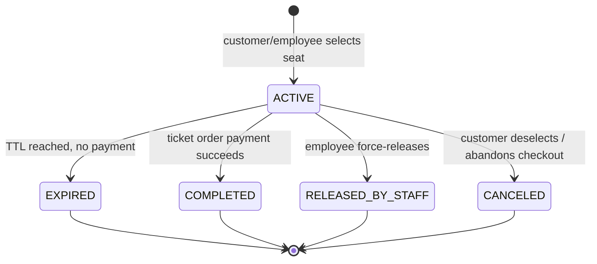
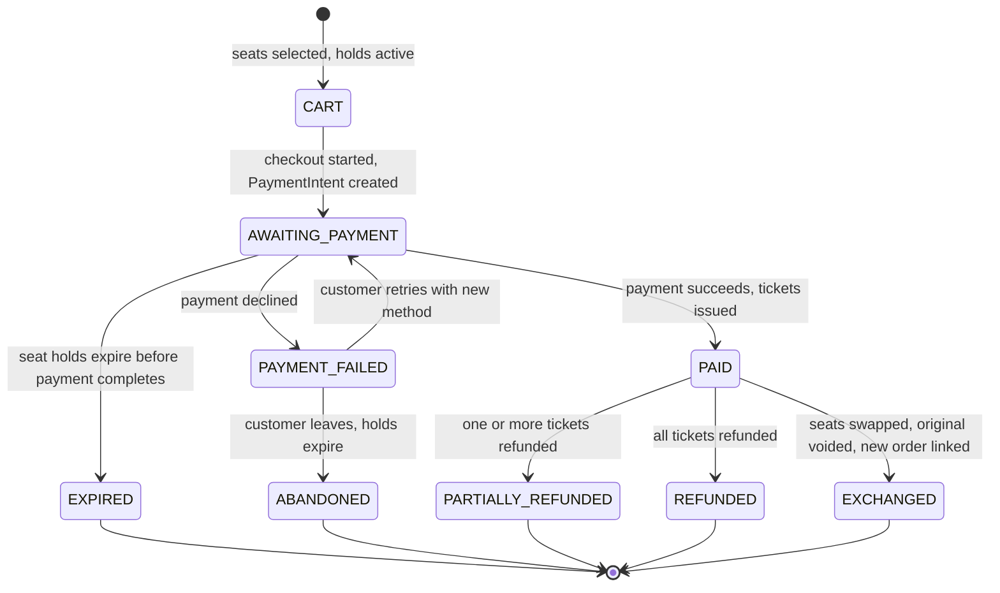
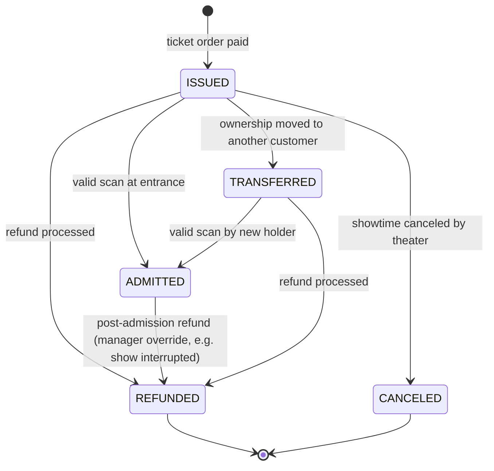
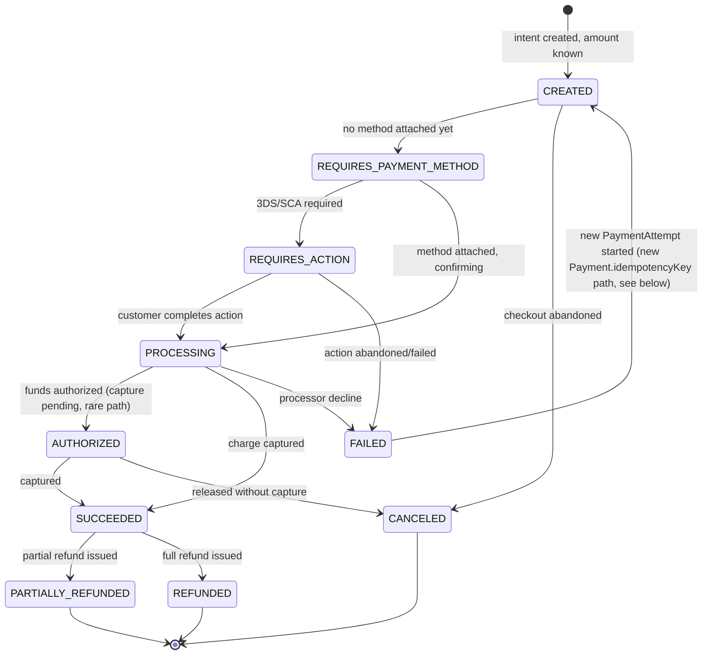
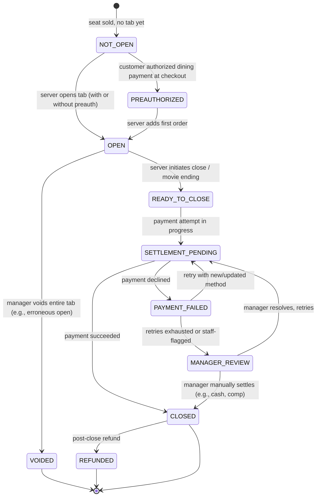
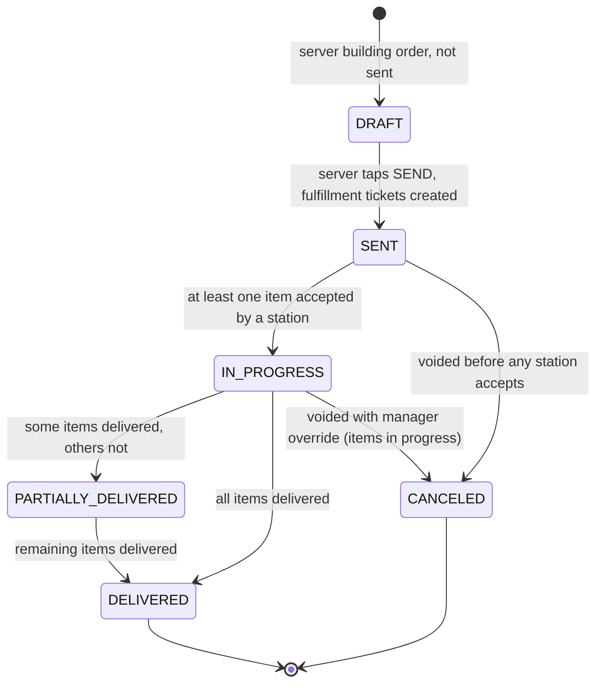
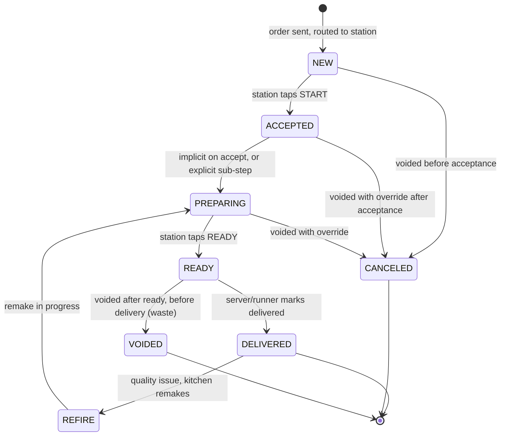

# State Machines

Status: Draft v1
Related: DATA_MODEL.md, SEAT_RESERVATION_DESIGN.md, PAYMENT_FLOW.md, RESTAURANT_WORKFLOW.md

Rule for all machines below: transitions are only ever performed inside a database transaction that also writes the triggering business record and an `AuditEvent` where the transition is sensitive (refund, void, manual override). No state is ever inferred from the frontend; the API is the only writer.

## 1. SeatHold

- Default TTL: 8 minutes, configurable per location.
- `ACTIVE` sets `ShowtimeSeat.status = HELD` and `currentHoldId`; any terminal transition clears both, and only if this hold is still the `currentHoldId` (prevents a late expiry job from releasing a seat a *newer* hold now legitimately owns).
- Expiry is enforced by Postgres (a checked `expiresAt` at read/lock time) as the ultimate authority; Redis TTL + a sweep job are convenience/UX layers, not the correctness mechanism (see SEAT_RESERVATION_DESIGN.md).

## 2. TicketOrder

- `AWAITING_PAYMENT → PAID` is the single transaction that: marks `ShowtimeSeat.status = SOLD`, resolves the `SeatHold` to `COMPLETED`, creates `Ticket` rows with QR tokens, and marks `Payment.status = SUCCEEDED`. All four happen together or none do.
- `EXPIRED` is reachable from `AWAITING_PAYMENT` either when the underlying `SeatHold`(s) expire before the processor confirms payment, or when payment *succeeds* but seat finalization subsequently fails — the latter is not just a state transition, it mandatorily triggers the automatic-refund recovery procedure in PAYMENT_FLOW.md §5.1 in the same transaction, never a silent charge with no further action.

## 3. Ticket

- A scan against an `ADMITTED` ticket (without transfer) returns `ALREADY_USED` and does **not** transition state — re-admission requires an explicit employee override action, which is itself an `AuditEvent`, not a normal scan.
- `REFUNDED` on a ticket does not automatically affect an associated `RestaurantTab` — see RESTAURANT_WORKFLOW.md edge case "refund includes ticket but not food."

## 4. Payment

- One `Payment` row is not overwritten across retries with a *different* card — a materially new attempt (different payment method) creates a new `PaymentAttempt` linked to the same `Payment` if it's the same logical charge (e.g., retry after decline before the tab closes), governed by `Payment.idempotencyKey` staying constant while `PaymentAttempt` rows accumulate. If the customer instead abandons and restarts checkout entirely, that is a new `TicketOrder`/`Payment` pair.
- `FAILED → CREATED` is drawn as a dashed logical retry path; implementation-wise this is "create a new `PaymentAttempt`, not a new `Payment`," to preserve the one-`Payment`-per-charge-intent invariant used for idempotency and reporting.

## 5. RestaurantTab

- `PREAUTHORIZED` exists distinctly from `OPEN` so the system (and staff UI) can show "payment on file, no orders yet" vs. "active tab with items" — matches the spec's box-office/server seat-state visuals (`Payment Needed`, `Tab Open`, etc., which are UI projections of this state plus order status, not separate fields).
- `OPEN → READY_TO_CLOSE` is, in the primary path, triggered by a server dropping the check (PAYMENT_FLOW.md §6.1) — a real staff action recorded as `checkDroppedAt`, not an automatic transition. One more order may still be sent after the check drops, before the server finalizes; finalizing (collecting payment, possibly split across several cards, not only the pre-authorized one) is what actually moves the tab to `SETTLEMENT_PENDING`. The "movie ending" trigger noted above is the fallback-only path (PAYMENT_FLOW.md §6.2), reachable only when no check was ever dropped for that tab.
- `SETTLEMENT_PENDING` is the guard against double-charging: a tab can only have one `Payment` in a non-terminal state at a time; the fallback settlement job (PAYMENT_FLOW.md §6.2) checks this before attempting a charge and is itself idempotent per tab per billing cycle via `Payment.idempotencyKey = tab.id + settlementAttemptWindow`.

## 6. RestaurantOrder

- `RestaurantOrder` status is a rollup of its `FulfillmentTicket` statuses (see below); it is stored (not purely computed) so the server POS list view can query cheaply, but it is only ever written by the same transaction that updates the underlying `FulfillmentTicket`/`RestaurantOrderItem` rows.

## 7. FulfillmentTicket (KDS / BDS unit)

- `REFIRE` increments `FulfillmentTicket.refireCount` and creates a linked new preparation cycle rather than mutating history away — the original `DELIVERED` timestamp and the refire are both retained for reporting ("refire rate" is a named operational report).
- Any `CANCELED`/`VOIDED` transition on an item that has already been billed to a tab requires either the order not yet being sent to the customer's visible tab total, or an explicit adjustment recorded against `RestaurantOrderItem` with an audit event — items are never silently removed from a customer-visible total.

## 8. Cross-machine invariants worth stating explicitly

- A `Ticket` can be `REFUNDED` while its associated `RestaurantTab` remains `OPEN`/`CLOSED` — the two machines are independent by design (see RESTAURANT_WORKFLOW.md edge cases).
- A `RestaurantTab` cannot move to `SETTLEMENT_PENDING` while any of its `RestaurantOrder`s are `DRAFT` (server hasn't sent an in-progress order) unless a manager forces a close with an explicit void/comp of the draft — prevents charging for an order the kitchen never saw.
- `SeatHold.COMPLETED` and `TicketOrder.PAID` are written in the same transaction; there is no window where one is true and the other isn't.
